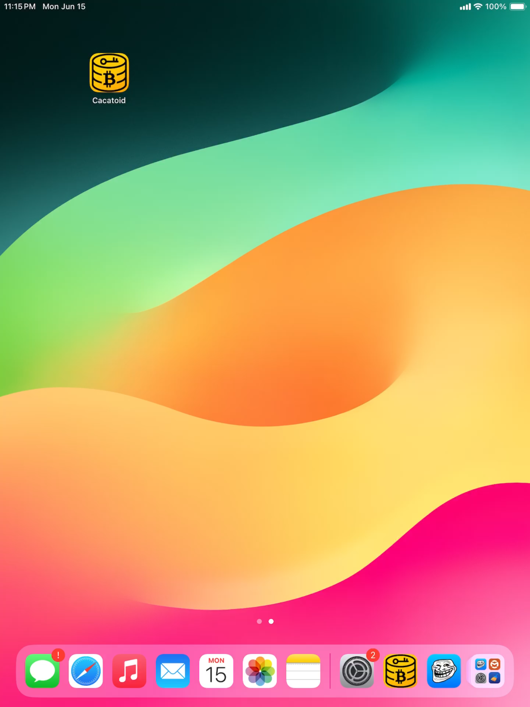
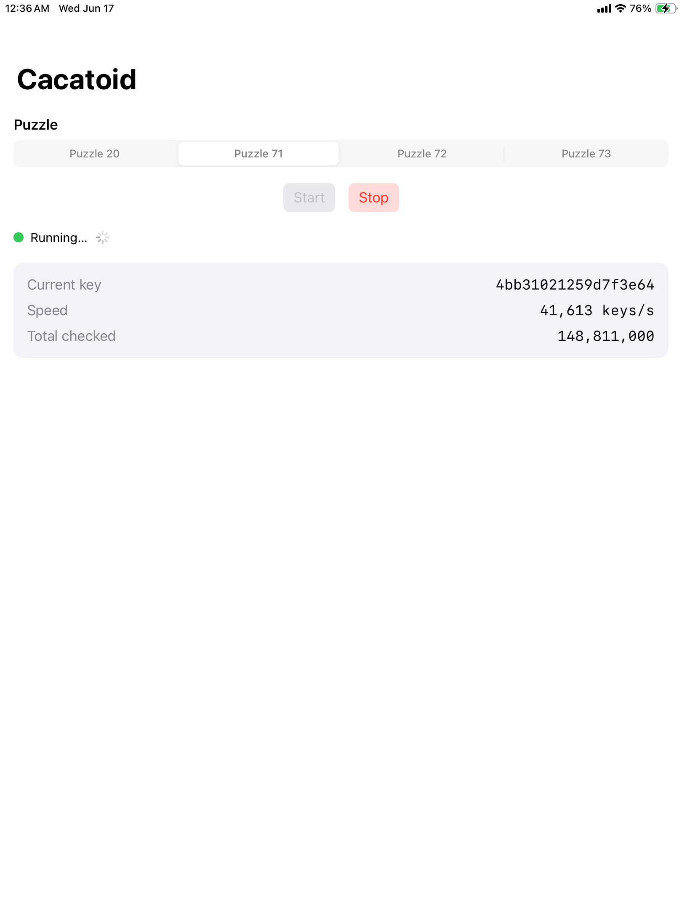
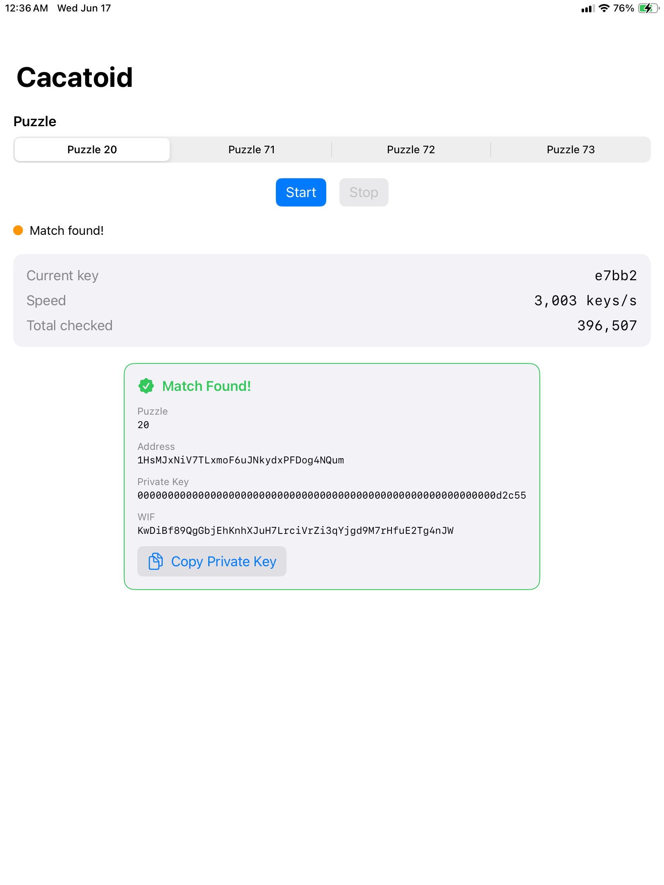

# Cacatoid

An iOS app that searches for the private key to unsolved [Bitcoin Puzzle](https://privatekeys.pw/puzzles/bitcoin-puzzle-tx) addresses, running a multi-threaded native key search directly on your iPhone or iPad.

> ⚠️ **For fun and learning.** The puzzles Cacatoid targets (71, 72, 73) have key spaces of roughly 2⁷⁰–2⁷². A modern iPhone checks hundreds of thousands to a few million keys per second, so the odds of an actual hit are astronomically small. Treat this as a demonstration of secp256k1 cryptography and iOS background processing, not a get-rich plan.

[](https://www.youtube.com/watch?v=ciO2_UeXU0U)

## Screenshots

| Home | Running | Match Found |
|------|---------|-------------|
|  |  |  |

## What it does

The [Bitcoin puzzle transaction](https://privatekeys.pw/puzzles/bitcoin-puzzle-tx) is a well-known challenge where puzzle *n* has a private key somewhere in the range `[2^(n-1), 2^n - 1]`, and the matching address is public. Cacatoid picks a target puzzle, derives the compressed P2PKH address for candidate keys, and compares it against the target.

- **Puzzle 20** — already solved; included as a built-in smoke test because its tiny range is found almost instantly, exercising the whole pipeline end to end.
- **Puzzles 71, 72, 73** — currently unsolved targets.

When a key matches, the app shows the private key (hex), WIF, and address and alerts the user immediately.

## How it works

```
ContentView (SwiftUI) ──▶ SearchViewModel ──▶ searcher_start() (C++) ──▶ worker threads
```

- **Native search (`ios/Cacatoid/Native/`)** — all cryptography and key iteration runs in C++: secp256k1 point multiply, SHA-256, RIPEMD-160, and Base58Check. Each worker thread samples random keys from the full puzzle range independently, using a time + ASLR-seeded RNG to avoid duplicate sequences across threads. A monitor thread reports throughput to Swift about twice a second; a match fires a callback immediately.
- **Swift bridge (`searcher_bridge.h`)** — a thin C interface (`searcher_start`, `searcher_stop`) called from Swift via a bridging header.
- **UI (`ContentView` + `SearchViewModel`)** — pick a puzzle, start/stop, and watch the current key, keys/sec, and total-checked counters update live.

128-bit range math uses `unsigned __int128`, supported by clang on 64-bit Apple Silicon and A-series targets.

## Download

Grab the latest `.ipa` from the [Releases](https://github.com/TorranceTech/cacatoid/releases) page and sideload it with [AltStore](https://altstore.io) or [Sideloadly](https://sideloadly.io).

## Building from source

Requires Xcode 15+ with the iOS SDK.

```bash
cd ios
xcodebuild -project Cacatoid.xcodeproj \
           -scheme Cacatoid \
           -configuration Release \
           -destination 'generic/platform=iOS' \
           archive -archivePath build/Cacatoid.xcarchive

xcodebuild -exportArchive \
           -archivePath build/Cacatoid.xcarchive \
           -exportPath build/ \
           -exportOptionsPlist ExportOptions.plist
```

Or open `ios/Cacatoid.xcodeproj` in Xcode and hit **Product → Archive**.

## Project layout

| Path | Purpose |
| --- | --- |
| `ios/Cacatoid/CacatoidApp.swift` | App entry point |
| `ios/Cacatoid/ContentView.swift` | SwiftUI UI and live stats |
| `ios/Cacatoid/SearchViewModel.swift` | UI state, start/stop |
| `ios/Cacatoid/Native/searcher.cpp` | Threaded search core |
| `ios/Cacatoid/Native/searcher_bridge.h` | C interface for Swift |
| `ios/Cacatoid/Native/secp256k1_utils.*` | secp256k1 wrapper |
| `ios/Cacatoid/Native/sha256.*`, `ripemd160.*`, `base58.*` | Crypto primitives |
| `ios/lib/libsecp256k1.a` | Static secp256k1 compiled for iOS arm64 |

## License

No license specified yet.
